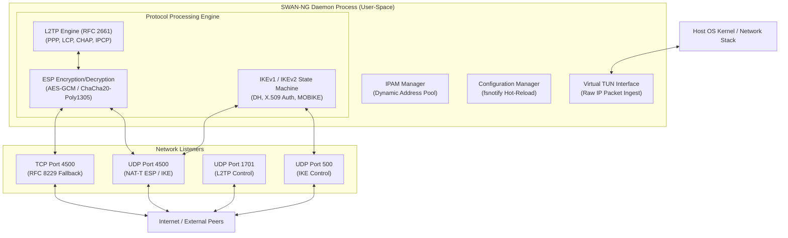

# 🦅 S/WAN Next-Generation (SWAN-NG) IPsec VPN

Welcome to the future of modern user-space VPNs! **SWAN-NG** (S/WAN Next Generation) is a secure, memory-safe, and highly portable next-generation IPsec VPN implementation built entirely in **pure Go** (`CGO_ENABLED=0`). Bypassing legacy OS kernel interfaces (like Linux XFRM, PF_KEYv2, or Windows WFP), SWAN-NG operates completely in user-space, delivering ironclad security, seamless portability, and bulletproof immunity to kernel-level networking vulnerabilities (such as Dirty Frag). 🐹✨

SWAN-NG provides a high-performance **user-space ESP data plane** over virtual TUN interfaces, multiplexes L2TP over IPsec for broad infrastructure compatibility, supports both legacy IKEv1 and modern IKEv2 negotiations, and automates certificate management for secure, cert-only IKEv2 configurations.

---

## ✨ Why SWAN-NG?

*   **🛡️ 100% Pure Go & Zero CGO:** Statically compiled with `CGO_ENABLED=0`. Zero dependencies on host cross-compilation toolchains, OpenSSL, `certutil`, or OS-specific kernel headers. Compiles cleanly to a standalone static binary.
*   **🦖 User-Space ESP Data Plane:** Implements IPsec ESP (Encapsulating Security Payload - RFC 4303) encryption/decryption (AES-GCM / ChaCha20-Poly1305) entirely in pure Go, utilizing virtual TUN adapters (e.g., `wireguard/tun`) to process packets safely in user-space.
*   **🔌 Integrated PPP & L2TP Server:** Fully-featured RFC 2661 L2TP engine with native PPP framing, LCP negotiation, CHAP authentication, and IPCP dynamic IP assignments for strong compatibility with appliances like MikroTik or Palo Alto Firewalls.
*   **🔐 Dual-Protocol IKEv1 & IKEv2 Support:** Core support for negotiating classic IKEv1 (RFC 2409) key exchanges and modern IKEv2 (RFC 7296) protocols. Supports robust Certificate, EAP, and Pre-Shared Key (PSK) authentication for IKEv2 to accommodate both high-security end-user clients and site-to-site peer-to-peer tunnels, while maintaining compatibility with legacy IKEv1 endpoints.
*   **📲 Profile Auto-Exporter:** Automatically generates and exports pre-configured client profiles (iOS/macOS `.mobileconfig`, StrongSwan `.sswan`, encrypted PKCS#12 `.p12`, and L2TP `.txt`) for instant, error-free client provisioning.
*   **🌐 Universal Operation Modes:** Seamlessly supports multiple concurrent topologies: operates natively as a Server (Responder), Client (Initiator), or Site-to-Site peer over shared or independent TUN interfaces.
*   **🔥 High-Throughput Buffering:** Employs reusable buffer pools (`sync.Pool`) for high-speed zero-copy network packet routing, minimizing garbage collection (GC) overhead under heavy traffic.
*   **🚀 Port Flexibility & TCP Fallback:** Binds natively to UDP Ports 500 (IKE), 4500 (NAT-T), and 1701 (L2TP). Implements RFC 8229 TCP encapsulation on TCP Port 4500 as a reliable fallback mechanism for UDP-restrictive networks.
*   **🔄 Zero-Downtime Hot-Reloading:** Integrates `fsnotify` to dynamically watch and hot-reload connection definitions (`ipsec.d/`) and user profiles (`profile.d/`) without restarting active services.
*   **📊 Leveled Structured Logging:** Provides clean, modern observability using Go's native `log/slog` and features auto-rotating file logs via `lumberjack`.

---

## 🏗️ Architecture at a Glance



---

## 🚀 Getting Started

### 📋 Prerequisites

*   **Go** (1.21+)
*   **Make** (For builds)

---

## 🛠️ Deployment

### 🐳 **Using Container**

1.  **Install Docker** following the [official guide](https://docs.docker.com/get-docker/).
2.  **Run the SWAN-NG daemon:**
    ```sh
    docker run -d \
      --cap-add=NET_ADMIN \
      --device /dev/net/tun:/dev/net/tun \
      -p 500:500/udp \
      -p 4500:4500/udp \
      -p 4500:4500/tcp \
      -p 1701:1701/udp \
      -v /path/to/config.yaml:/etc/swan-ng/config.yaml \
      -v /path/to/profile.d:/etc/swan-ng/profile.d \
      -v /path/to/ipsec.d:/etc/swan-ng/ipsec.d \
      --name swan-ng \
      dimaskiddo/swan-ng:latest
    ```

### 📦 **Using Pre-Built Binaries**

1.  Download the latest release from the [Releases Page](https://github.com/dimaskiddo/swan-ng/releases).
2.  **Installation & Startup:**

#### 🐧 **Linux / 🍎 macOS**
```sh
# Give it execution permissions
chmod +x swan-ng

# Install background service (requires sudo)
sudo ./swan-ng service install --config /path/to/config.yaml

# Start the background service
sudo ./swan-ng service start
```

#### 🪟 **Windows**
*(Run from an Administrator Command Prompt)*
```powershell
# Install system service
.\swan-ng.exe service install --config C:\path\to\config.yaml

# Start service
.\swan-ng.exe service start
```

### 🏗️ **Build From Source**

```sh
git clone https://github.com/dimaskiddo/swan-ng.git
cd swan-ng
make vendor
make build
# The standalone static binary is located in dist/swan-ng
```

---

## 🕹️ Usage & Commands

SWAN-NG features a powerful CLI for resident management, profile distribution, and user accounts:

### 💂‍♂️ Daemon Management
*   **`swan-ng daemon [--config path]`**: Start the resident VPN engine, allocate the virtual TUN interface, and bind the UDP and TCP fallback ports.

### 🔌 L2TP User Management (Infrastructure / PPP Profiles)
*   **`swan-ng l2tp add-user <username> [--config path]`**: Add an L2TP user credential.
    *   Prompts interactively for the L2TP password, securely masking the input characters.
    *   Generates a secure `.txt` distribution profile containing the remote VPN Server Domain, designated L2TP Username, unmasked L2TP Password, and matching IPsec Pre-Shared Key (PSK) read directly from the connection block.

### 🔐 IKEv2 User Management (Certificates & Profiles)
*   **`swan-ng ikev2 add-user <username> [--config path]`**: Add an IKEv2 client identity.
    *   Prompts interactively for certificate validity period (defaults to 120 months).
    *   Generates a dedicated X.509 client certificate and private key in pure Go (under CA authority).
    *   Automatically exports pre-packaged configuration profiles including PKCS#12 (`.p12`), iOS/macOS profiles (`.mobileconfig`), and Android StrongSwan configurations (`.sswan`).

### ⚙️ Service Control
Register and manage the daemon seamlessly inside the host OS (Systemd, Launchd, or Windows Services):
*   `swan-ng service install [--config path]`: Register the application as a background service.
*   `swan-ng service uninstall`: Remove the registered background service.
*   `swan-ng service start`: Start the background service.
*   `swan-ng service stop`: Stop the background service.

---

## 🧪 Testing

SWAN-NG implements standard and rigorous unit tests. Run them easily:
```sh
go test ./...
```
*Note: The complete test suite contains dedicated tests validating IPAM pools, X.509 generation, PKCS#12 packaging, and complete L2TP PPP control/data packet parsers.*

---

## ✍️ Authors

*   **Dimas Restu Hidayanto** - *Initial Work & Architecture* - [DimasKiddo](https://github.com/dimaskiddo)

---

## 🏗️ Built With Love & Power

*   **[Go](https://golang.org/)** - High-performance engine backend.
*   **[Cobra](https://github.com/spf13/cobra)** - Modern CLI parsing framework.
*   **[wireguard-tun](https://git.zx2c4.com/wireguard-tun/)** - Pure Go virtual TUN interface implementation.
*   **[fsnotify](https://github.com/fsnotify/fsnotify)** - Cross-platform dynamic profile filesystem watcher.
*   **[go-pkcs12](https://github.com/sslmate/go-pkcs12)** - Modern pure Go PKCS#12 archive formatting.
*   **[lumberjack](https://github.com/natefinch/lumberjack)** - Safe and automated structured log rolling.

---

## ⚠️ Disclaimer

**DO WITH YOUR OWN RISK (DWYOR)**. This software is provided "as is", without warranty of any kind, express or implied. Operating user-space IP tunnels involves low-level network interface changes. The authors are not responsible for any network instability, system crashes, data loss, or security failures arising from the deployment of this daemon.

---

## ⚖️ License

Distributed under the **MIT License**. See `LICENSE` for more information.

---
**SWAN-NG** — *Next-Generation User-Space IPsec for a Secure World.* 🦅🌐
