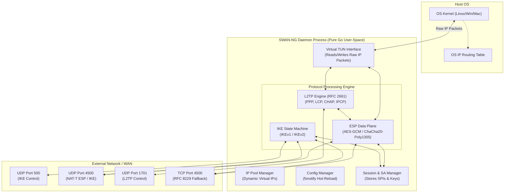

# SWAN-NG Architecture

## Core Architectural Design
SWAN-NG shifts the entire IPsec paradigm from a monolithic OS Kernel stack into a fully isolated **User-Space Networking Engine**. 

By utilizing Virtual TUN (Tunnel) interfaces, SWAN-NG requests the host OS to route specific CIDR blocks into a virtual file descriptor. From there, SWAN-NG takes over the networking stack entirely in Go.

## High-Level Component Architecture

## Module Breakdown

1. **TUN Interface Wrapper (`internal/tun`)**
   - Interacts with the host OS (via `golang.zx2c4.com/wireguard/tun`).
   - Ingests bare IP packets meant for the internal subnet.
   - Handles OS-specific MTU sizes and gracefully deals with platform differences (e.g. Windows TUN drivers vs Linux `/dev/net/tun`).

2. **Protocol Engine (`internal/ike`, `internal/l2tp`, `internal/esp`)**
   - Contains strict state machines for IKEv1, IKEv2, and L2TP PPP negotiations.
   - Fully parses network headers without allocating excessive byte slices (zero-copy design where possible).

3. **Session & Security Association (SA) Manager (`internal/session`)**
   - Central source of truth for active tunnels.
   - Maps inbound SPIs (Security Parameter Indices) to symmetric cryptographic keys.
   - Manages the lifecycle and eviction of sessions to ensure isolated authentication and no overlapping SPI collisions.

4. **Cryptographic Primitives (`internal/crypto`)**
   - Strictly relies on Go's `crypto` and `golang.org/x/crypto` standard libraries.
   - Completely sidesteps OpenSSL for absolute dependency-free compilation.

5. **Configuration Watcher (`internal/config`)**
   - Utilizes `fsnotify` to track `.yaml` profile changes and instantly rotate or apply credentials without a hard restart.

## Detailed Workflows

For a deep dive into specific components and protocols, please visit the detailed workflow documentation:

- [Project Overview](PROJECT.md)
- [Client & Server Topologies](CLIENT_SERVER.md)
- [LibreSWAN Porting Note](PORTING_NOTE.md)
- [Common IKE Concepts](WORKFLOW_IKE.md)
- [IKEv1 Workflow (Legacy)](WORKFLOW_IKEV1.md)
- [IKEv2 Workflow (Next-Gen)](WORKFLOW_IKEV2.md)
- [ESP Data Plane Workflow](WORKFLOW_ESP.md)
- [UDP & TCP Encapsulation](WORKFLOW_UDP_TCP.md)
