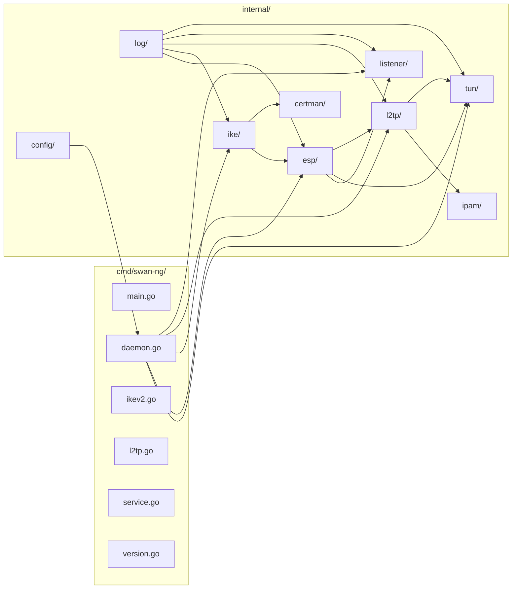

# SWAN-NG — Architecture

Cross-platform user-space IPsec VPN in Go: ESP data plane, IKEv1/IKEv2 control plane, L2TPv2 for infrastructure appliances. Single static binary (`CGO_ENABLED=0`). **Config defaults:** see `config.yaml.example` — never guess values.

---

## Module Map



---

## Component Table

| Component | Package | Role |
|---|---|---|
| **ESP** | `internal/esp/` | User-space ESP data plane — AEAD/CBC encryption, SADatabase, anti-replay, NAT-T demux, PMTU, sync.Pool buffer pool. Bridges TUN ↔ UDP. |
| **IKE** | `internal/ike/` | IKEv1 + IKEv2 control plane — state machines, DH key exchange, proposal negotiation, EAP (MSCHAPv2/TLS), DPD, fragmentation, retransmission. Bridges to ESP via SessionManager. |
| **L2TP** | `internal/l2tp/` | L2TPv2 LNS server (RFC 2661) — tunnel/session state machines, PPP framing, LCP, CHAP-MD5, IPCP, reliable delivery. Dedicated IPAM pool. |
| **TUN** | `internal/tun/` | Platform-agnostic TUN device via `wireguard/tun`. ReadPacket/WritePacket with PI header offset. Linux/macOS/Windows build tags. |
| **Listener** | `internal/listener/` | UDP listener manager — binds ports 500 (IKE), 4500 (NAT-T/ESP), 1701 (L2TP). Per-port goroutines with shared BufferPool. |
| **IPAM** | `internal/ipam/` | Bitmap-based IPv4 address pool. Range: `"startIP - endIP"`, max 65536. Thread-safe. Separate pools for IKEv2 and L2TP. |
| **Certman** | `internal/certman/` | PKI — ECDSA P-384 CA/server/client certs. Export: .p12, .mobileconfig, .sswan, .txt (L2TP profile). |
| **Config** | `internal/config/` | YAML config via viper. Exe-relative path resolution. fsnotify watcher for profile.d/ hot-reload. |
| **Log** | `internal/log/` | `log/slog` + lumberjack rotation. Dual output (stdout + file). |

---

## Protocol Implementations

### ESP (RFC 4303)

| Cipher | ID | Type |
|---|---|---|
| AES-128-GCM | 1 | AEAD (RFC 4106) |
| AES-256-GCM | 2 | AEAD (RFC 4106) |
| ChaCha20-Poly1305 | 3 | AEAD (RFC 7634) |
| AES-128-CBC | 10 | CBC + HMAC |
| AES-256-CBC | 11 | CBC + HMAC |

| Integrity | ID | RFC |
|---|---|---|
| HMAC-SHA1-96 | 2 | RFC 2404 |
| HMAC-SHA256-128 | 12 | RFC 4868 |
| HMAC-SHA384-192 | 13 | RFC 4868 |
| HMAC-SHA512-256 | 14 | RFC 4868 |

Other: Anti-replay window (128-pkt bitmap, RFC 4303 §3.4.3), NAT-T (RFC 3948), PMTU/ICMP Frag Needed (RFC 792/1191), TFC dummy packets (NextHeader=59).

### IKE

| DH Group | ID | Type |
|---|---|---|
| MODP-1024 | 2 | Legacy |
| MODP-1536 | 5 | Legacy |
| MODP-2048 | 14 | Standard |
| ECP-256 | 19 | Recommended |
| ECP-384 | 20 | Strong |
| ECP-521 | 21 | Strongest |

| PRF | Integrity Truncation |
|---|---|
| HMAC-SHA1 | 96-bit |
| HMAC-SHA256 | 128-bit |
| HMAC-SHA384 | 192-bit |
| HMAC-SHA512 | 256-bit |

IKEv2 encryption: AES-GCM-16 (AEAD), AES-CBC + PKCS#7, 3DES.

Features: IKEv1 Main/Aggressive/Quick Mode + XAUTH/ModeCfg. IKEv2 SA_INIT/IKE_AUTH/CREATE_CHILD_SA/INFORMATIONAL. EAP-MSCHAPv2 (RFC 2759), EAP-TLS (RFC 5216). IKE Fragmentation (RFC 7383). DPD (RFC 3706). Retransmission with exponential backoff. Cookie anti-DoS.

**Partial/Planned:** MOBIKE (RFC 4555) — NotifyType constant + config field defined, no handler. TCP Encapsulation (RFC 8229) — config fields defined (`enable-tcp`, `tcp-remoteport`), not implemented.

### L2TP (RFC 2661)

Control: SCCRQ/SCCRP/SCCCN/StopCCN/Hello. Session: ICRQ/ICRP/ICCN/CDN. Reliable delivery: Ns/Nr sliding window, ZLB ACK, exponential backoff (1s-8s, 5 retries).

PPP stack: LCP (MRU+Auth+Magic), CHAP-MD5 (RFC 1994), IPCP (IP-Address+DNS per RFC 1332/1877). ACFC/PFC compression.

---

## Key Interfaces

```go
// Cross-package coupling (internal/esp/)
type TUNReader interface { ReadPacket(buf []byte) (int, error) }
type TUNWriter interface { WritePacket(buf []byte, n int) error }
type UDPSender interface { SendTo(port int, data []byte, remoteAddr *net.UDPAddr) error }
type L2TPHandler interface { HandlePacket(data []byte, peerAddr *net.UDPAddr) }

// Internal/ike/
type DHGroup interface { ID(); GenerateKeypair(); ComputeSharedSecret(); PublicKeySize() }
type PRFAlgorithm interface { ID(); KeySize(); OutputSize(); Compute(); NewHash() }
type IntegrityAlgorithm interface { ID(); KeySize(); OutputSize(); Compute(); Verify() }
type IKEEncryptor interface { ID(); KeySize(); IVSize(); BlockSize(); IsAEAD(); Encrypt(); Decrypt() }

// Internal/l2tp/
type UserDatabase interface { LookupUser(username string) (string, bool) }
type ResponseSender interface { SendL2TPResponse(data []byte, peerAddr *net.UDPAddr) error }
```

---

## Configuration

### Config Sections

| Section | Purpose |
|---|---|
| `server` | Hostname, listen address |
| `logging` | Level, output mode, file path, lumberjack rotation |
| `tun` | Device name (`swan0`), MTU (`1280`) |
| `ipsec` | Connections map (50+ fields mirroring LibreSWAN `ipsec.conf(5)`), connection_dir, hot_reload |
| `ikev2` | Enabled, cookie_mode, IPAM pool, profile.d paths, hot_reload |
| `l2tp` | Enabled, IPAM pool (separate from IKEv2), profile.d paths, hot_reload |

### Search Order

1. `--config <path>` flag
2. Binary's directory (via `os.Executable()` + symlink resolution)
3. Defaults from loader

### Hot-Reload

`config.Watcher` uses `fsnotify` to monitor `ipsec.d/` and `profile.d/` directories. On change: debounce → re-parse YAML → swap config atomically.

---

## Cross-Platform

| Concern | Solution |
|---|---|
| TUN device | `wireguard/tun` (Wintun on Windows) |
| File paths | `filepath.Join()` everywhere — no hardcoded separators |
| Service mgmt | `kardianos/service` — systemd (Linux), launchd (macOS), SCM (Windows) |
| Build | `CGO_ENABLED=0`, `GOOS`/`GOARCH` cross-compile |

---

## Key Design Decisions

1. **User-space only** — no kernel IPsec APIs (XFRM, PF_KEYv2, WFP). TUN interfaces for all packet I/O.
2. **Zero-allocation buffers** — `sync.Pool` (`esp.BufferPool`) with `clear()` on return. No per-packet allocation.
3. **Single static binary** — `CGO_ENABLED=0`. All crypto via Go stdlib (`crypto/` + `golang.org/x/crypto`).
4. **ECDSA P-384 PKI** — CA (25yr), server (10yr), client (configurable, default 120mo).
5. **Protocol resiliency** — ESP/IKE never panic on malformed packets. Log at Debug/Warn, silently drop.
6. **Session isolation** — single connection per identity/certificate. Reconnect evicts old session + removes ESP SAs.
7. **Config relative to binary** — not CWD. Avoids ambiguity in daemon/service mode.
8. **Streaming I/O** — never `os.ReadFile` on target files. Chunked processing for memory efficiency.
9. **Stdlib first** — minimal third-party deps. Approved: `wireguard/tun`, `fsnotify`, `lumberjack`, `go-pkcs12`, `x/term`, `cobra`, `viper`, `yaml.v3`, `uuid`.
10. **No stubs** — every function production-ready. No `// TODO` or placeholders.

---

## References

| File | Purpose |
|---|---|
| `docs/WORKFLOWS.md` | Pipeline flows, stage details, error recovery |
| `docs/CLIENT_SERVER.md` | Client & server topologies |
| `docs/PORTING_NOTE.md` | LibreSWAN → SWAN-NG porting notes |
| `docs/PROJECT.md` | Project overview |
| `docs/WORKFLOW_ESP.md` | ESP data plane deep-dive |
| `docs/WORKFLOW_IKE.md` | Common IKE concepts |
| `docs/WORKFLOW_IKEV1.md` | IKEv1 protocol flow |
| `docs/WORKFLOW_IKEV2.md` | IKEv2 protocol flow |
| `docs/WORKFLOW_UDP_TCP.md` | UDP & TCP encapsulation |
| `config.yaml.example` | Full annotated config reference |
