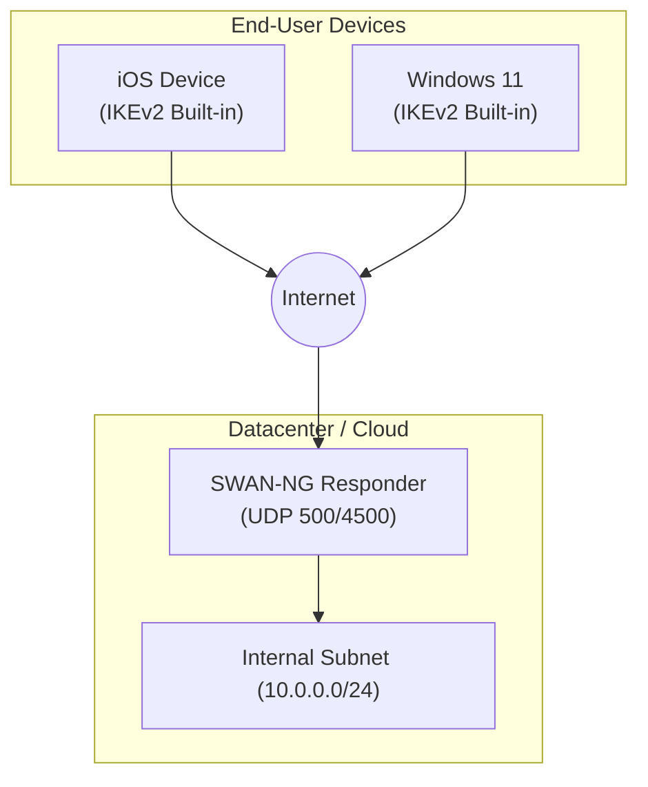
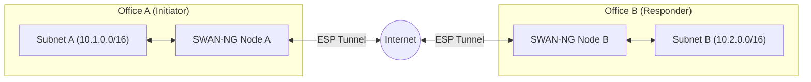
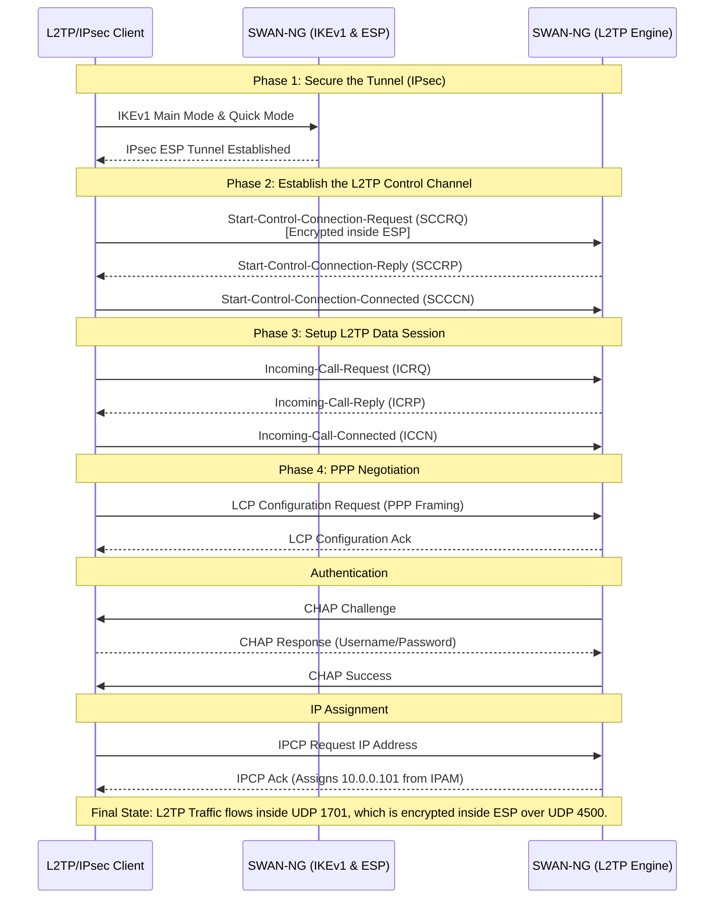

# Client-Server Communication Topologies

SWAN-NG is designed to be a universal VPN daemon, meaning the exact same binary can act as a server, a client, or a peer in a site-to-site topology.

## 1. IKEv2 End-User Topology

This is the standard topology for modern mobile clients (iOS, macOS, Android StrongSwan, Windows IKEv2) connecting to the central SWAN-NG VPN server.

### Communication Flow:
1. Client requests a connection on UDP 500.
2. IKE_SA_INIT and IKE_AUTH complete.
3. SWAN-NG assigns a virtual IP (e.g. `10.0.0.100`) from its internal IPAM pool to the client.
4. Client traffic is encapsulated in ESP over UDP 4500.

## 2. Site-to-Site Topology

In this scenario, two offices are securely bridged. Both sides run SWAN-NG. One is configured as `right=%any` (Responder), and the other has `right=Public_IP` (Initiator).

### Communication Flow:
1. Node A (Initiator) boots and reads its configuration.
2. It actively contacts Node B on UDP 500.
3. They authenticate (usually via Pre-Shared Key).
4. Node A routes `10.2.0.0/16` into its TUN interface. Node B routes `10.1.0.0/16` into its TUN interface.
5. All traffic between subnets is transparently encrypted by ESP.

## 3. L2TP over IPsec Topology (Infrastructure Compatibility)

Layer 2 Tunneling Protocol (L2TP) is frequently used by infrastructure hardware (MikroTik routers, Palo Alto firewalls) and legacy OS endpoints.
L2TP lacks inherent security, so it is strictly encapsulated *inside* an IPsec tunnel.

### L2TP Data Workflow

### Authentication Isolation

In the L2TP over IPsec topology, authentication is strictly split into two layers:
1. **Machine Authentication (IPsec):** Validated via a Pre-Shared Key (PSK) configured in the `ipsec.d/` connection block.
2. **User Authentication (L2TP/PPP):** Validated via CHAP credentials configured in the `profile.d/` blocks. Multiple users can share the same IPsec connection, but are isolated by their unique PPP credentials.
