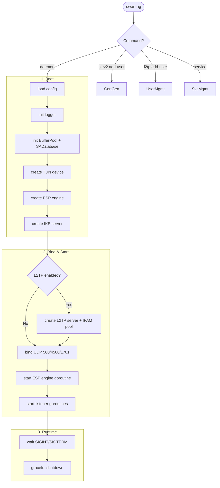

# SWAN-NG — Workflows

Core orchestration: config load → daemon startup → runtime → shutdown. Protocol details live in dedicated `WORKFLOW_*.md` files.

---

## Pipeline Overview



---

## Startup (`cmd/swan-ng/daemon.go`)

1. **Config:** `config.Load(path)` — resolve from `--config` flag or binary dir.
2. **Logger:** `log.InitLogger(cfg.Logging)` — dual output (stdout + file) when `output: "file"`.
3. **Buffer pool:** `esp.NewBufferPool(esp.MaxPacketSize)` — sync.Pool with zero-on-return.
4. **SA database:** `esp.NewSADatabase()` — thread-safe SPI→SA map.
5. **TUN:** `tun.NewDevice(ctx, name, mtu)` — wireguard/tun, platform-specific. Checks `tun.Available()` first.
6. **ESP engine:** `esp.NewEngine(cfg)` — binds TUN reader/writer + UDP sender + SA database.
7. **IKE server:** `ike.NewServer(sessionMgr, v1Handler, v2Handler, listenMgr)` — dispatches by IKE version.
8. **L2TP** (if enabled): `initL2TPServer()` — creates dedicated IPAM pool, loads `profile.d/` users, registers with ESP engine via `SetL2TPHandler()`.
9. **Bind UDP:** Ports 500 (IKE), 4500 (NAT-T + ESP demux), 1701 (L2TP direct).
10. **Start:** `go espEngine.Start(ctx)` + `go listenMgr.Start(ctx)`.
11. **Block:** `<-ctx.Done()` — waits for SIGINT/SIGTERM.

---

## Protocol Flows

Detailed protocol mechanics live in dedicated files. Each covers its topic end-to-end — no overlap here.

| Topic | File | Covers |
|---|---|---|
| ESP data plane | [WORKFLOW_ESP.md](WORKFLOW_ESP.md) | Packet flow, encryption/decryption, zero-copy buffering |
| IKE common concepts | [WORKFLOW_IKE.md](WORKFLOW_IKE.md) | SA, SPD, IKE header, key exchange overview |
| IKEv1 | [WORKFLOW_IKEV1.md](WORKFLOW_IKEV1.md) | Main Mode, Aggressive, XAUTH, Quick Mode |
| IKEv2 | [WORKFLOW_IKEV2.md](WORKFLOW_IKEV2.md) | SA_INIT, IKE_AUTH, EAP, MOBIKE |
| UDP/TCP encapsulation | [WORKFLOW_UDP_TCP.md](WORKFLOW_UDP_TCP.md) | NAT-T demux, UDP ports, TCP fallback (RFC 8229) |

---

## L2TP Flow

L2TP is unique — not extracted to a dedicated file. Full detail below.

```
Control: SCCRQ → SCCRP → SCCCN (tunnel established)
         ICRQ → ICRP → ICCN (session established)

PPP:     LCP (MRU=1500, Auth=CHAP-MD5, Magic)
         CHAP: Challenge(16 random bytes) → Response(MD5) → Success/Failure
         IPCP: peer requests 0.0.0.0 → server NAKs with assigned IP → peer re-requests → ACK
         IPv4: encapsulated in PPP frames → forwarded to TUN
```

Reliable delivery: Ns/Nr sliding window, ZLB ACKs, exponential backoff (1s-8s, 5 retries).

---

## User Management

**IKEv2** (`cmd/swan-ng/ikev2.go`):
1. `certman.InitCA()` → load or create ECDSA P-384 CA
2. `certman.InitServerCert()` → load or create server cert with hostname SAN
3. `certman.GenerateClientCert()` → user-specified validity (default 120 months)
4. Export: `.p12` (go-pkcs12), `.mobileconfig` (Apple), `.sswan` (Android strongSwan)

**L2TP** (`cmd/swan-ng/l2tp.go`):
1. `certman.InitCA()` + `certman.InitServerCert()` (same CA)
2. Masked password prompt via `x/term`
3. Write `profile.d/<username>.yaml` for user credentials
4. Generate `.txt` distribution profile (server + username + password + PSK)

---

## Hot-Reload

**Config watcher** (`internal/config/watcher.go`): monitors `ipsec.d/` and `profile.d/` via `fsnotify`. On change: debounce → re-parse YAML → swap config atomically. Triggers `EngineFactory` to rebuild ESP engines if connection params changed.

---

## File Naming Conventions

| File | Location | Pattern |
|---|---|---|
| Config | binary dir or `--config` | `config.yaml` |
| Config example | project root | `config.yaml.example` |
| Binary | `dist/` | `swan-ng` (or `swan-ng.exe`) |
| IKEv2 client cert | `certs/` | `<username>.crt`, `<username>.key` |
| IKEv2 client bundle | output dir | `<username>.p12` |
| IKEv2 Apple profile | output dir | `<username>.mobileconfig` |
| IKEv2 Android profile | output dir | `<username>.sswan` |
| L2TP user profile | `profile.d/` | `<username>.yaml` |
| L2TP distribution | output dir | `<username>.txt` |
| CA certificate | `certs/` | `ca.crt`, `ca.key` |
| Server certificate | `certs/` | `server.crt`, `server.key` |
| Log file | configured path | `swan-ng.log` |

---

## Error Recovery

| Scenario | Recovery |
|---|---|
| TUN unavailable | Logs warning, daemon starts without TUN (control plane only) |
| UDP bind fails | Logs error for specific port, continues binding others |
| Invalid ESP packet | Logs at Debug/Warn, silently drops — never panics |
| IKE retransmit | Exponential backoff (1s → 16s), max 5 retries |
| IKE fragment reassembly | `FragmentManager` cache per SPI pair + message ID |
| L2TP control timeout | Exponential backoff (1s-8s), 5 retries, then tunnel→Dead state |
| L2TP CHAP auth fail | Returns Failure to client, session terminates |
| Config parse error | Returns error, daemon refuses to start |
| Hot-reload parse fail | Logs error, previous config remains active |
| SIGINT/SIGTERM | Context cancellation → graceful shutdown of TUN, listeners, L2TP server |
