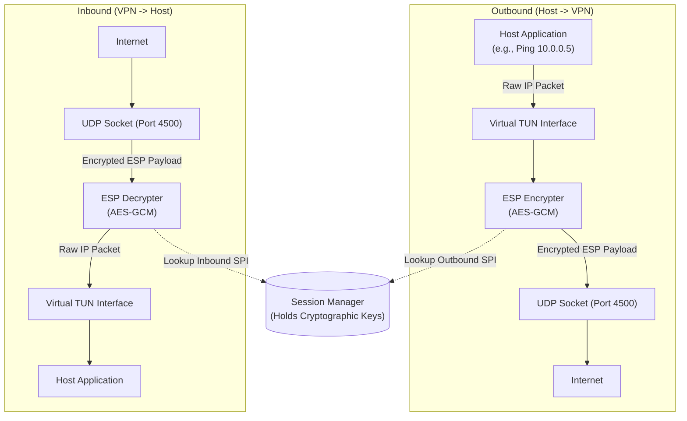

# ESP (Encapsulating Security Payload) Workflow

The ESP data plane is the core engine of SWAN-NG. It operates entirely in user-space, avoiding the traditional Linux kernel XFRM stack. This guarantees that SWAN-NG is completely immune to kernel-level vulnerabilities (like Dirty Frag) and is inherently cross-platform.

## ESP Packet Flow

When an IPsec tunnel is active, packets follow a strict path through the Go user-space engine.

## Encryption & Decryption Process

SWAN-NG uses high-speed AEAD (Authenticated Encryption with Associated Data) ciphers like **AES-128-GCM**, **AES-256-GCM**, or **ChaCha20-Poly1305** from Go's standard `crypto` library.

### 1. Inbound Processing (Decryption)
1. A UDP packet arrives on port 4500.
2. SWAN-NG strips the UDP header to reveal the ESP header.
3. The engine reads the 32-bit **SPI (Security Parameter Index)** from the ESP header.
4. It queries the `Session Manager` for the decryption keys associated with that SPI.
5. If the keys are found, it authenticates the ICV (Integrity Check Value) and decrypts the payload.
6. If the payload is valid, it strips the ESP padding and writes the bare inner IP packet to the virtual TUN interface.
7. If decryption fails, the packet is silently dropped to prevent timing attacks.

### 2. Outbound Processing (Encryption)
1. The host OS routes a raw IP packet (e.g., destined for `10.0.0.5`) into the TUN interface.
2. SWAN-NG reads the packet from the TUN file descriptor.
3. It checks the Security Policy Database (SPD) to find the active Child SA for that destination IP.
4. It wraps the raw IP packet in an ESP header (using the Outbound SPI), adds padding, and encrypts it using the Outbound Key.
5. The resulting encrypted payload is wrapped in a UDP packet and dispatched to the remote peer's public IP.

## Zero-Copy Buffering Strategy

To achieve high throughput without crashing the Go garbage collector, SWAN-NG uses `sync.Pool`.
Every time a packet is read from the TUN interface or the UDP socket, it is read into a pre-allocated byte slice from a pool. Once the packet has been processed (encrypted or decrypted) and sent on its way, the slice is returned to the pool. No new memory is allocated during steady-state packet forwarding.
