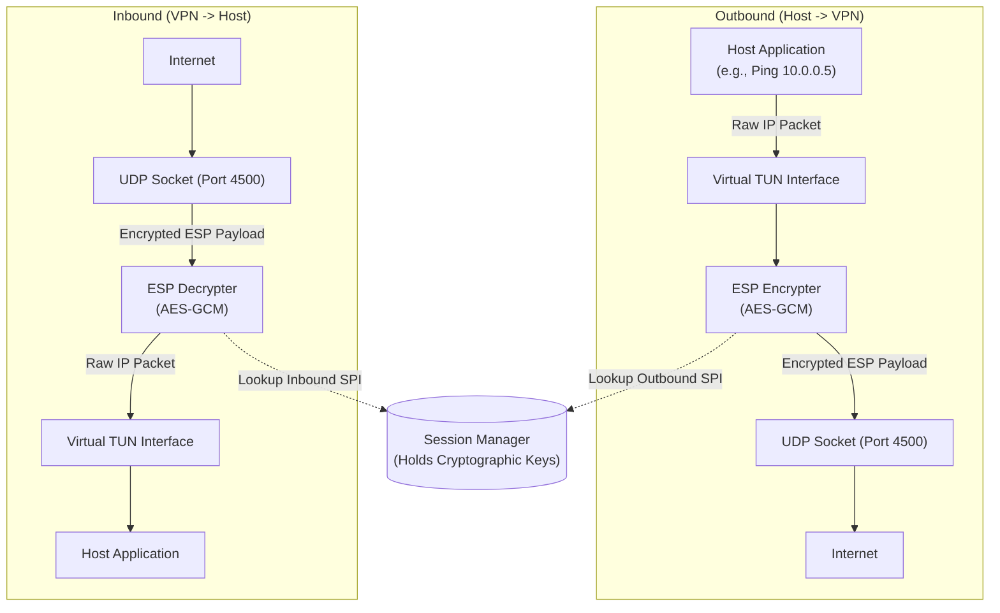

# SWAN-NG — ESP Data Plane

User-space ESP encryption/decryption via `internal/esp/`. Immune to kernel XFRM/Dirty Frag vulnerabilities. All crypto via Go stdlib.

---

## Packet Flow

---

## Inbound Processing (Decryption)

1. UDP packet arrives on port 4500.
2. Strip UDP header → ESP header visible.
3. Read 32-bit **SPI** from ESP header.
4. Query `SADatabase` for decryption keys by SPI.
5. Authenticate ICV, decrypt payload.
6. Strip ESP padding → write bare inner IP packet to TUN.
7. If decryption fails → silently drop (prevents timing attacks).

## Outbound Processing (Encryption)

1. Host OS routes raw IP packet (e.g., `10.0.0.5`) into TUN.
2. Read packet from TUN file descriptor.
3. Look up **Security Policy Database (SPD)** — destination IP → active Child SA.
4. Wrap in ESP header (Outbound SPI), add padding, encrypt with Outbound Key.
5. Send encrypted UDP packet to remote peer's public IP.

## Cipher Suites

| Cipher | ID | Type |
|---|---|---|
| AES-128-GCM | 1 | AEAD (RFC 4106) |
| AES-256-GCM | 2 | AEAD (RFC 4106) |
| ChaCha20-Poly1305 | 3 | AEAD (RFC 7634) |
| AES-128-CBC | 10 | CBC + HMAC |
| AES-256-CBC | 11 | CBC + HMAC |

---

## Zero-Copy Buffering

- `sync.Pool` (`esp.BufferPool`) holds pre-allocated byte slices of `MaxPacketSize`.
- **Get:** returns buffer with `clear()` (zeroes content, prevents data leaks).
- **Put:** returns buffer to pool. Wrong-sized buffers silently discarded.
- No new allocation during steady-state forwarding.
- Used by: `listener.Manager` (UDP read loop), `esp.Engine` (outbound loop).
