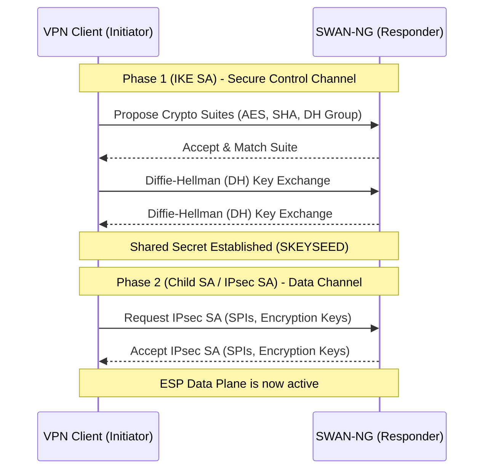
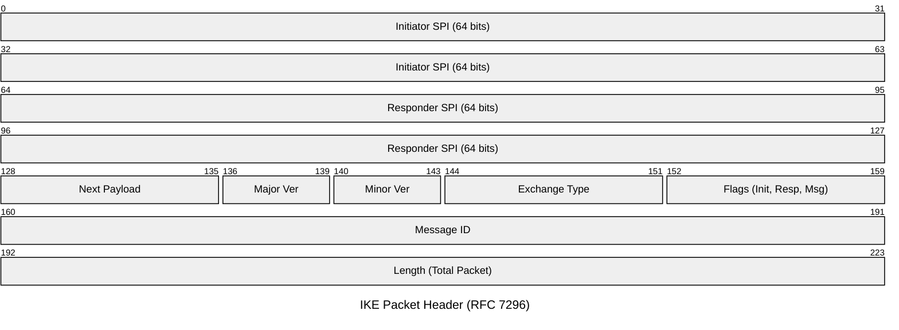

# SWAN-NG — IKE Core Concepts

IKE is the control plane for IPsec. SWAN-NG handles it in user-space on UDP 500 (standard) and UDP 4500 (NAT-T).

---

## Common Workflow

Before encrypted data flows, IKE establishes cryptographic keys. Both v1 and v2 follow this high-level pattern:

---

## Security Association (SA)

Logical contract between peers defining encryption/decryption rules.

| SA Type | Purpose |
|---|---|
| **IKE SA** | Encrypts IKE control messages (keep-alives, rekeying requests) |
| **Child SA (IPsec SA)** | Encrypts actual user traffic via ESP data plane |

Each SA identified by a **Security Parameter Index (SPI)** — 32-bit (IPsec) or 64-bit (IKE) number in the packet header.

## Security Policy Database (SPD)

Firewall rule-set dictating which traffic must be encrypted.

| Traffic | Action |
|---|---|
| Matches protected CIDR (e.g., `10.0.0.0/24`) | Encrypt and send via ESP |
| No match | Bypass / drop (unencrypted) |

---

## IKE Header

Every IKE packet (v1 and v2) begins with this 28-byte header:

- **Initiator/Responder SPI** — looks up cryptographic keys in `SessionManager`.
- **Major Version** — routes to `internal/ikev1` or `internal/ikev2` engine.
- **Message ID** — detects packet loss and replay attacks over UDP.
