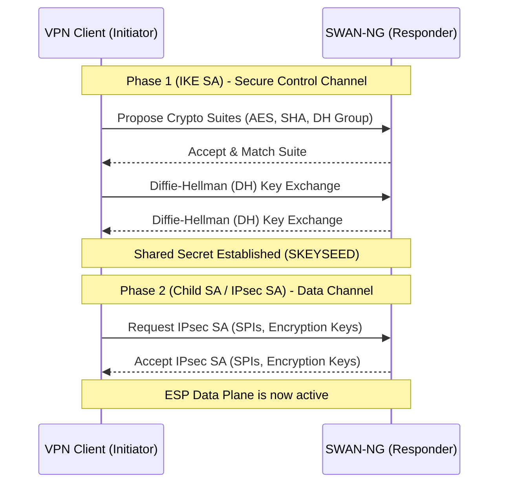
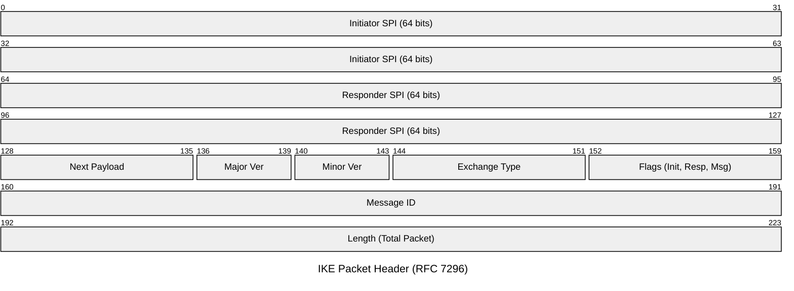

# IKE (Internet Key Exchange) Core Concepts

The Internet Key Exchange (IKE) protocol is the control plane for IPsec. SWAN-NG handles IKE entirely in user-space, listening on UDP port 500 (standard IKE) and UDP port 4500 (NAT-Traversal).

## Common IKE Workflow

Before any encrypted user data can flow through the VPN, the IKE daemon must securely establish cryptographic keys. Regardless of version (IKEv1 or IKEv2), this process always follows a similar high-level pattern:

## Security Association (SA)

An SA is a logical contract between two network peers. It defines the rules for encrypting and decrypting data.
- **IKE SA:** Used only to encrypt IKE control messages (like keep-alives or requests for new tunnels).
- **Child SA (IPsec SA):** Used exclusively by the **ESP data plane** to encrypt actual user traffic (e.g., HTTP, ICMP, L2TP).

Each SA is identified by a **Security Parameter Index (SPI)**, which is a 32-bit (IPsec) or 64-bit (IKE) number embedded in the packet header.

## Security Policy Database (SPD)

The SPD acts as a firewall rule-set. It dictates what traffic *must* be encrypted.
When a raw packet arrives at the TUN interface, SWAN-NG consults the SPD:
- Does this IP match `10.0.0.0/24`? Yes -> Encrypt and send via ESP.
- Does this IP match `8.8.8.8`? No -> Drop or send unencrypted (bypass).

## The IKE Header

Every IKE packet (v1 and v2) begins with a standard header that allows SWAN-NG to route the packet to the correct session state machine:

- **Initiator/Responder SPI:** Used by SWAN-NG to quickly look up the cryptographic keys in the `Session Manager`.
- **Major Version:** SWAN-NG parses this to split logic between the `internal/ikev1` and `internal/ikev2` engines.
- **Message ID:** Crucial for detecting packet loss and replay attacks over UDP.
