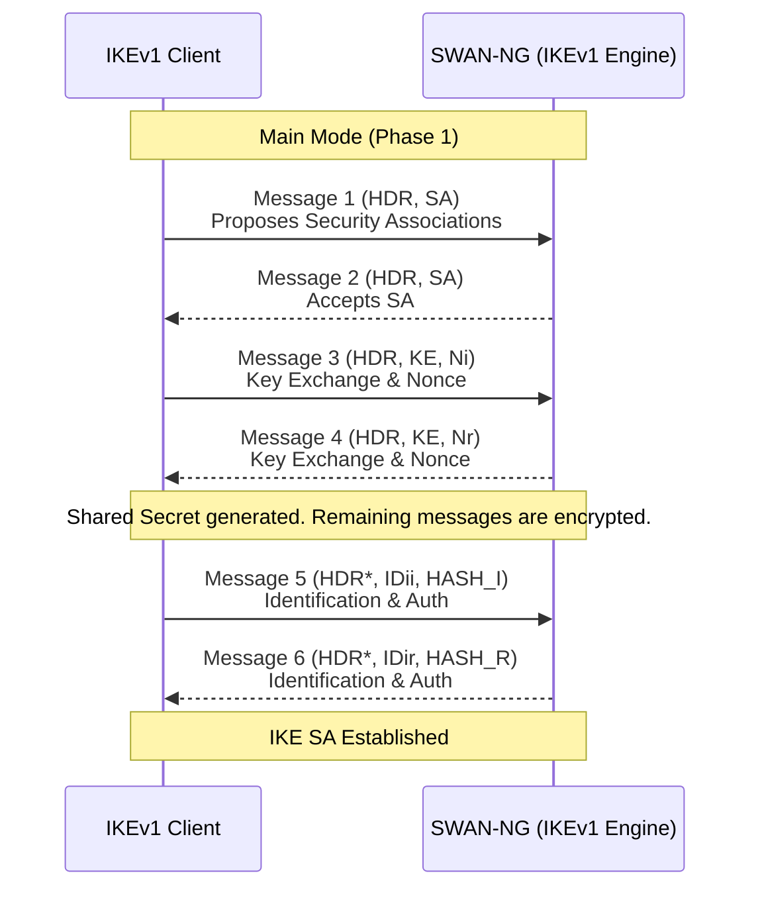
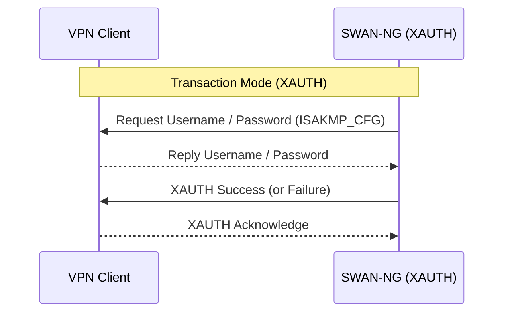
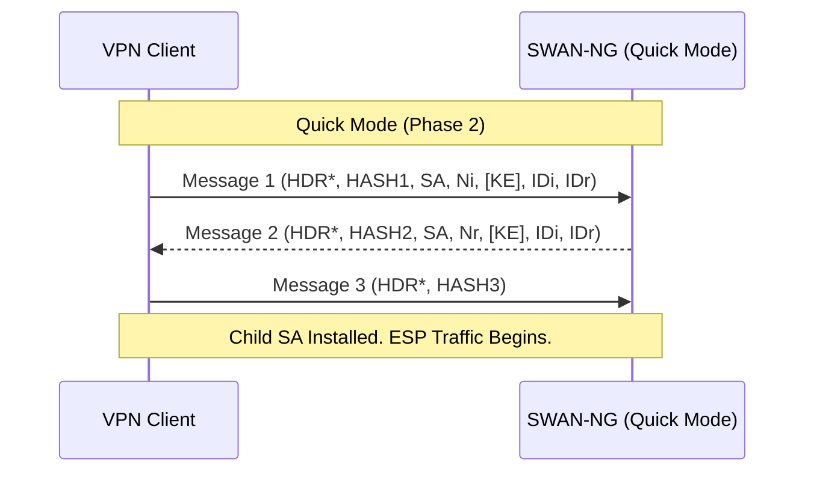

# IKEv1 Workflow (Legacy IPsec)

SWAN-NG implements the IKEv1 (RFC 2409) state machine to ensure backward compatibility with legacy endpoints and appliances.

## IKEv1 State Machine (Main Mode)

In IKEv1, Phase 1 (ISAKMP SA) establishes the secure control channel using 6 messages in **Main Mode**.

## IKEv1 Extended Authentication (XAUTH)

For end-user VPN clients (like macOS built-in VPN or legacy Android clients), IKEv1 requires an additional legacy authentication step called **XAUTH**. This happens inside the encrypted IKE SA.

## Quick Mode (Phase 2 - IPsec SA)

Once Phase 1 and XAUTH are complete, SWAN-NG negotiates the actual ESP data tunnel using **Quick Mode** (3 messages).

## NAT-Traversal (NAT-T) in IKEv1

SWAN-NG detects if a client is behind a NAT router during Messages 3 and 4 of Main Mode using `NAT-D` payloads.
If a NAT is detected, SWAN-NG dynamically shifts the socket from **UDP 500** to **UDP 4500** and encapsulates ESP traffic in UDP.
