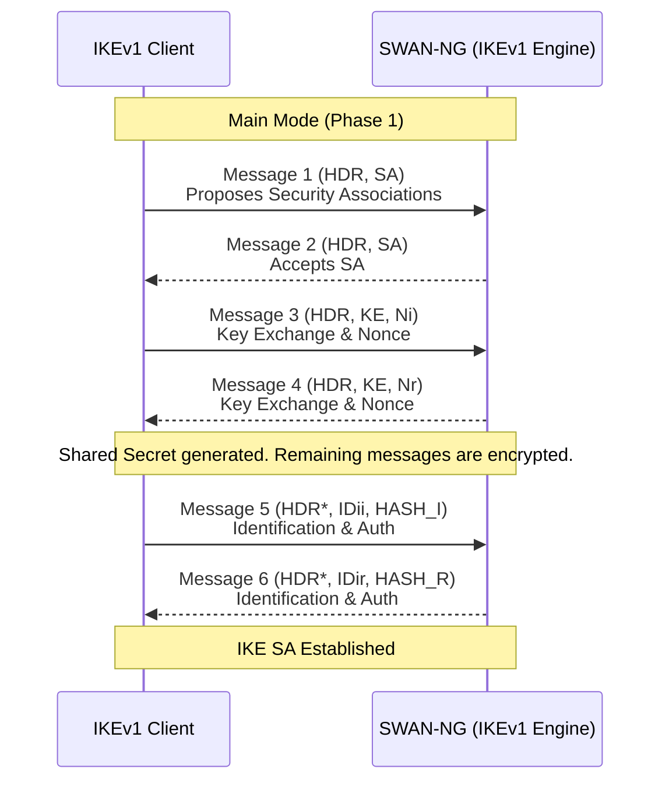
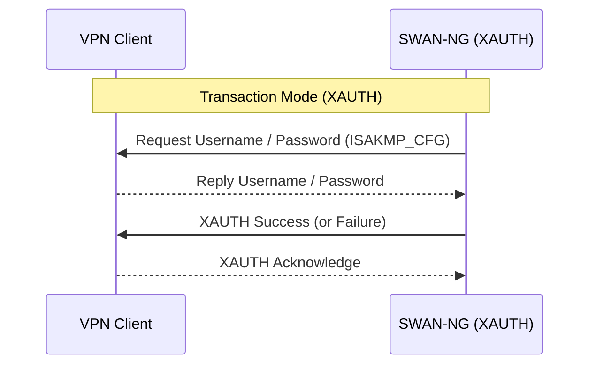
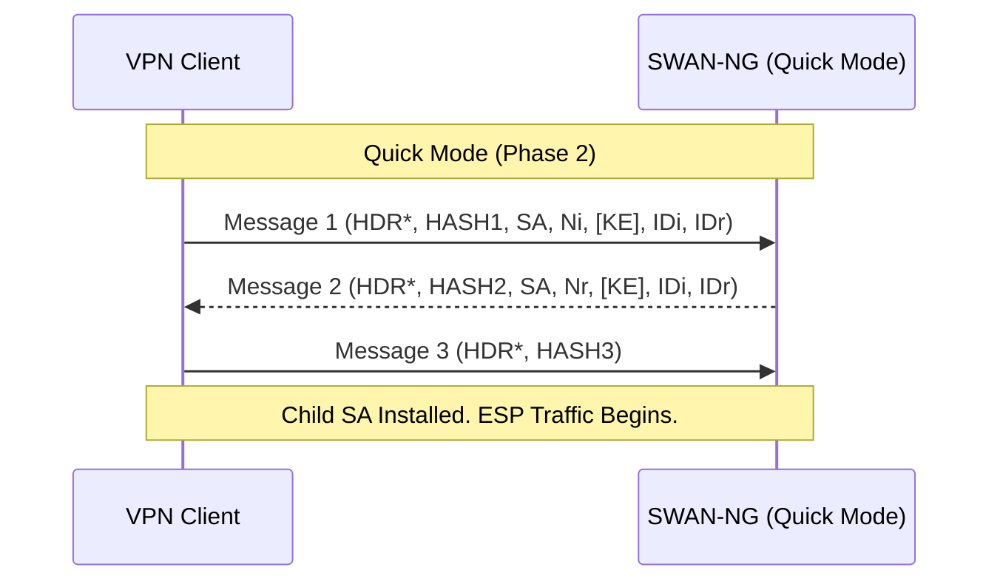

# SWAN-NG — IKEv1

IKEv1 (RFC 2409) for backward compatibility with legacy endpoints and appliances.

---

## Main Mode (Phase 1)

6 messages establish the secure control channel (ISAKMP SA):

Key derivation: `DeriveIKEv1Keys()` (RFC 2409 §5) → SKEYID, SKEYID_d/a/e.

---

## XAUTH (Extended Authentication)

Additional legacy auth step inside encrypted IKE SA for end-user VPN clients:

---

## Quick Mode (Phase 2 — IPsec SA)

3 messages negotiate the actual ESP data tunnel after Phase 1 + XAUTH:

---

## NAT-T in IKEv1

NAT detected via `NAT-D` payloads during Messages 3–4 of Main Mode. If detected, socket shifts from UDP 500 → UDP 4500 with ESP wrapped in UDP.
