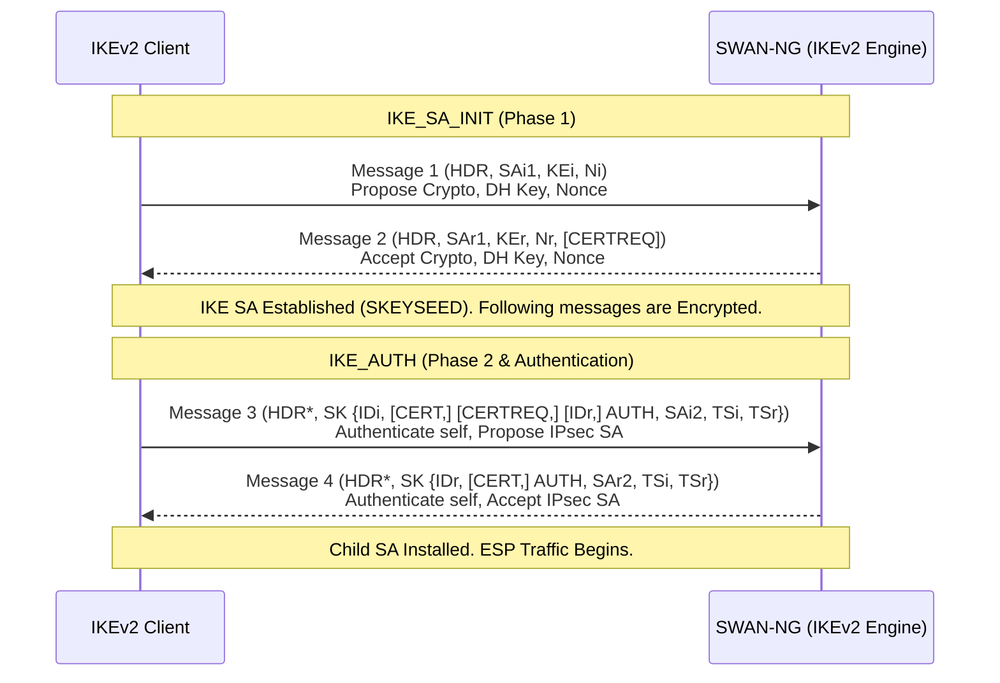
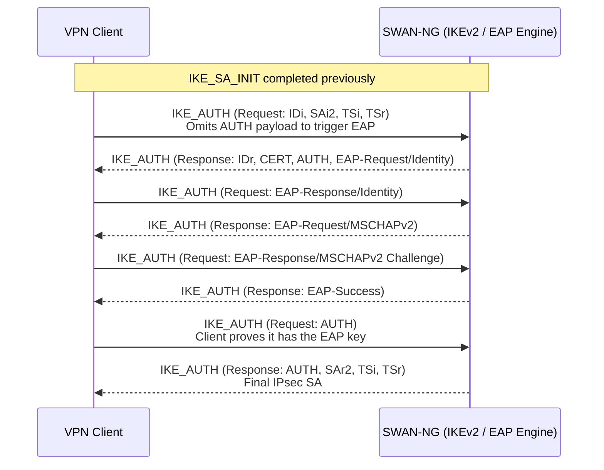
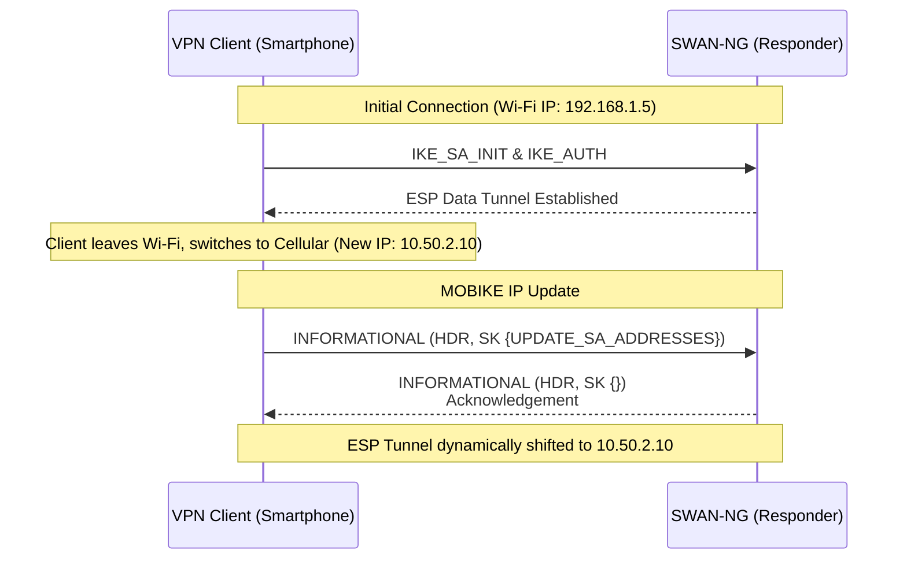

# IKEv2 Workflow (Next-Generation IPsec)

SWAN-NG prioritizes the modern IKEv2 (RFC 7296) state machine for robust, mobile-friendly (MOBIKE), and highly secure deployments.
IKEv2 is significantly more efficient than IKEv1, establishing both the control channel and the data tunnel in just 4 messages.

## The IKEv2 State Machine (IKE_SA_INIT & IKE_AUTH)

Every IKEv2 connection follows two distinct phases inside a single fast sequence.

## Advanced Authentication (EAP)

For enterprise scenarios, SWAN-NG supports EAP (Extensible Authentication Protocol) over IKEv2.
When EAP is used, the `IKE_AUTH` phase extends to carry EAP messages back and forth before the final IPsec SA is authorized.

## MOBIKE (RFC 4555)

SWAN-NG supports MOBIKE to allow clients (like smartphones) to seamlessly switch between Wi-Fi and Cellular networks without dropping the VPN connection.

Even though the full implementation phase for MOBIKE has not yet started, the architectural design ensures that when the client's IP changes, it simply sends an `INFORMATIONAL` packet with an `UPDATE_SA_ADDRESSES` payload from its new IP. SWAN-NG verifies the packet mathematically and dynamically updates the ESP tunnel endpoint without forcing a re-authentication.

