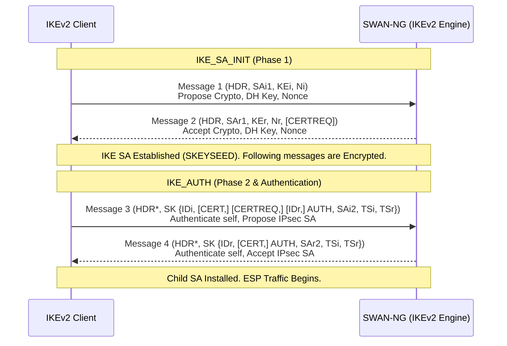
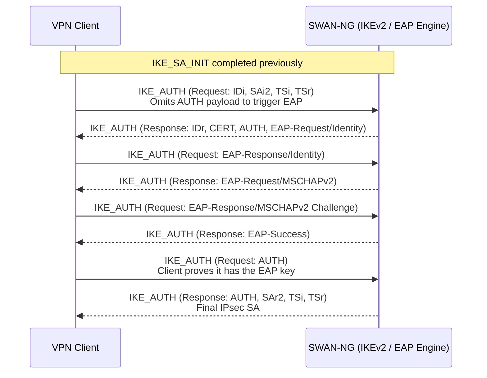
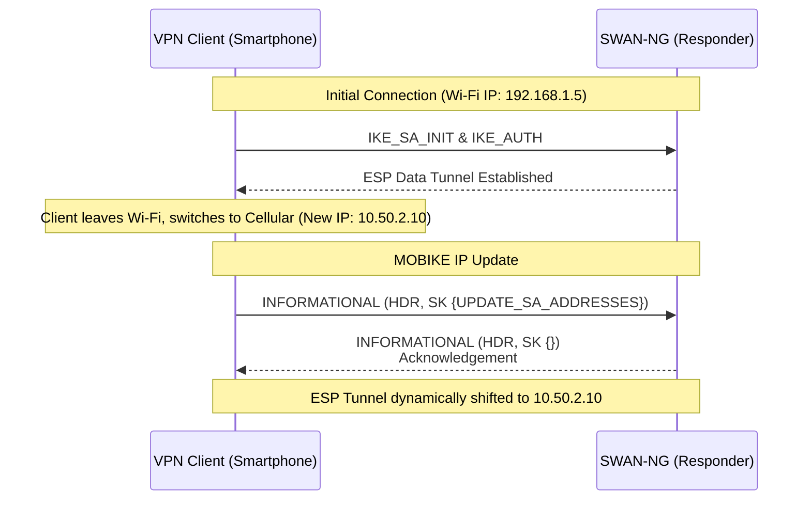

# SWAN-NG — IKEv2

IKEv2 (RFC 7296) — modern, mobile-friendly, establishes control channel + data tunnel in 4 messages.

---

## SA_INIT & IKE_AUTH

Key derivation: `DeriveIKEv2Keys()` (RFC 7296 §2.14) → SK_d, SK_ai/ar, SK_ei/er, SK_pi/pr.
Child SA keys: `DeriveChildSAKeys()` (RFC 7296 §2.17) → KEYSRC/KEYMAT.

SessionManager bridges to ESP: `InstallV2ChildSA()` → creates `esp.SecurityAssociation` + installs into `esp.Engine` SPD.

---

## EAP Authentication

For enterprise scenarios — IKE_AUTH extends to carry EAP messages before final IPsec SA authorization:

Supported EAP methods: EAP-MSCHAPv2 (RFC 2759), EAP-TLS (RFC 5216).

---

## MOBIKE (RFC 4555)

Seamless network handover (Wi-Fi ↔ Cellular) without re-authentication — client IP updated via INFORMATIONAL with `UPDATE_SA_ADDRESSES`.

**Partial:** NotifyType constant + config field defined, no handler implemented yet.

