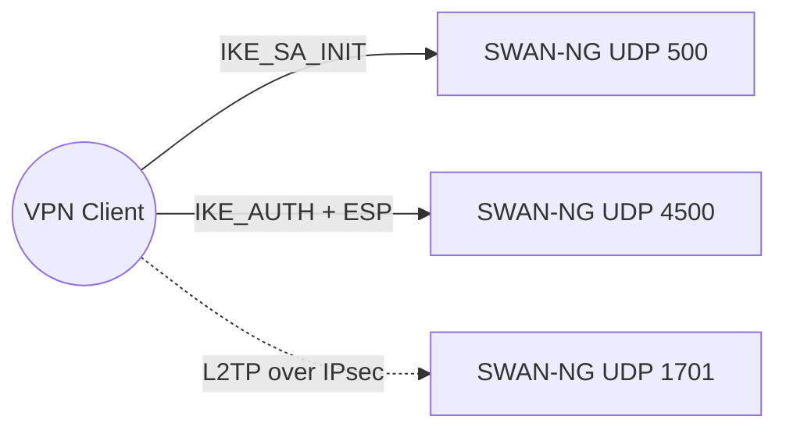
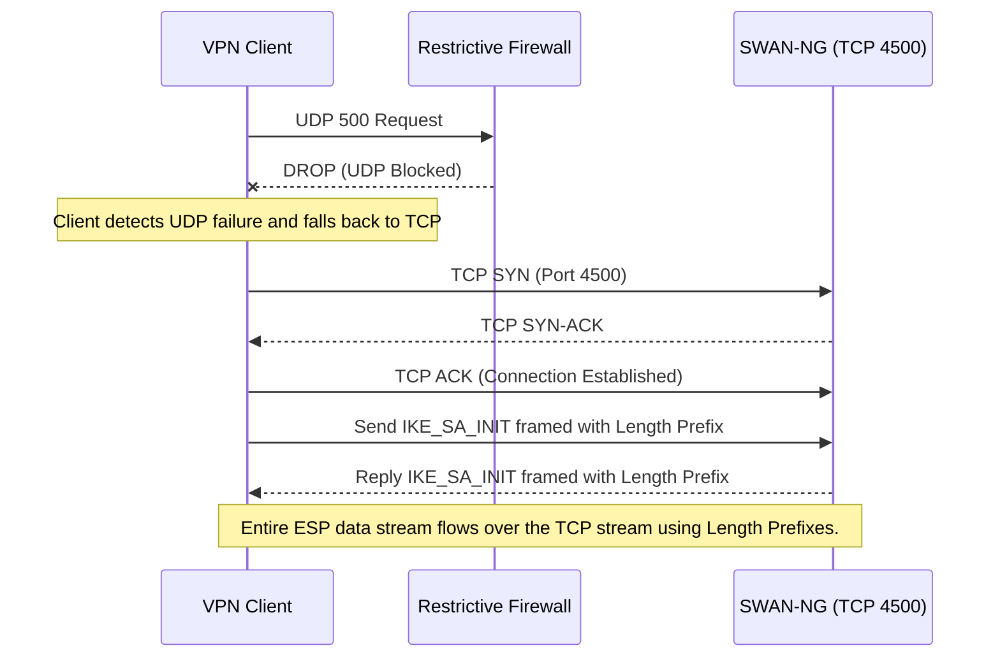
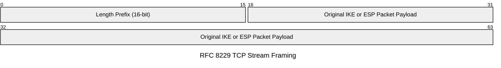

# UDP and TCP Encapsulation

Because SWAN-NG operates in user-space, it cannot rely on raw IP protocols (like IP Protocol 50 for ESP) natively at the OS socket level without special privileges or bypassing network firewalls. Therefore, SWAN-NG strictly encapsulates all traffic within standard Layer 4 protocols (UDP and TCP).

## The Standard Port Bindings

SWAN-NG attempts to bind to three standard UDP ports when it starts:

- **UDP 500 (IKE Control):** Used for initial IKEv1 and IKEv2 negotiations.
- **UDP 4500 (NAT-T ESP):** Used for NAT-Traversal. All encrypted ESP data and subsequent IKE packets are sent here to traverse home/office routers.
- **UDP 1701 (L2TP Control):** Used exclusively for legacy L2TP/PPP session establishment.

## NAT-Traversal (UDP 4500)

When a VPN client is on a Wi-Fi network or behind a home router, their internal IP (e.g., `192.168.1.5`) is translated to a public IP by a NAT device.
Raw ESP packets do not have UDP/TCP ports, meaning NAT devices cannot track them in state tables, causing dropped packets.
SWAN-NG resolves this automatically using standard NAT-T:
1. It detects NAT presence during the initial UDP 500 handshake.
2. It shifts all subsequent communication to UDP 4500.
3. ESP packets are prepended with an empty 4-byte UDP header.

## TCP Fallback (RFC 8229)

In highly restrictive corporate or public networks, firewalls may block all UDP traffic entirely, breaking standard IPsec connections.
SWAN-NG implements **RFC 8229 (TCP Encapsulation of IKE and IPsec Packets)** to guarantee connectivity.

### TCP Workflow

### TCP Stream Framing

Because TCP is a continuous stream, SWAN-NG prefixes every single ESP or IKE packet with a 16-bit Length integer, ensuring the packet boundaries can be correctly sliced from the stream buffer before decryption.

