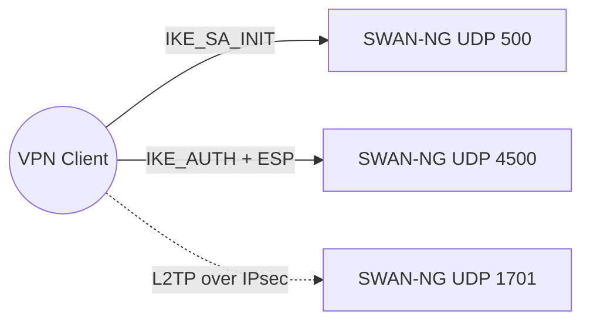
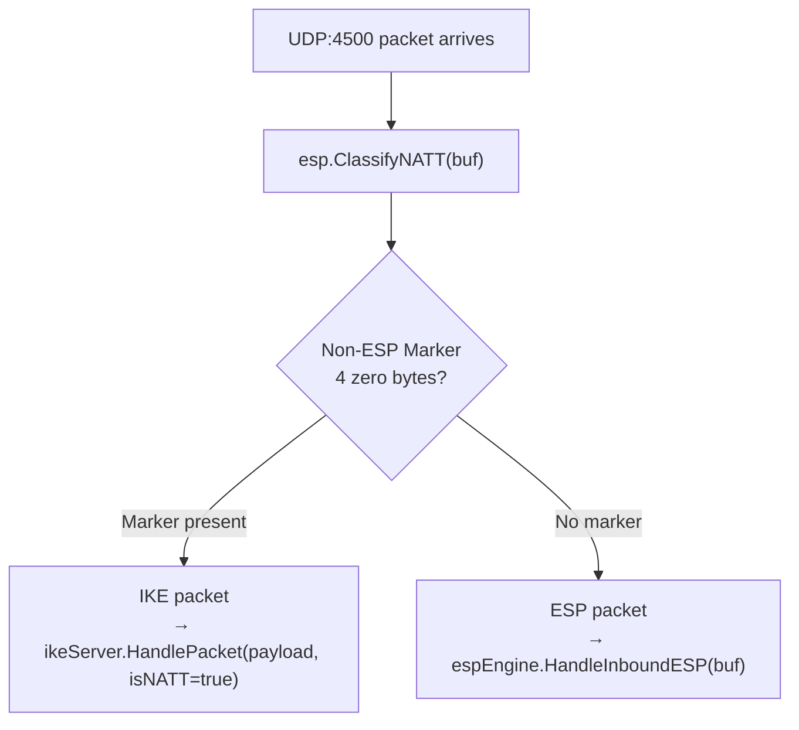
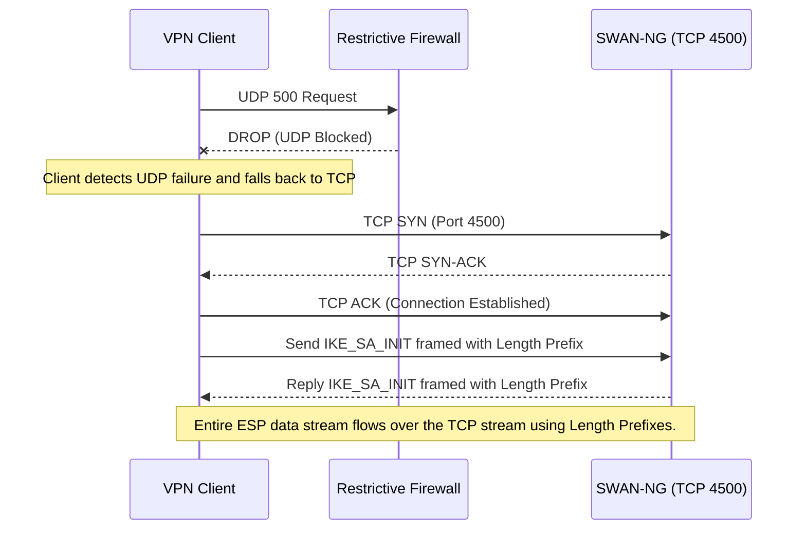
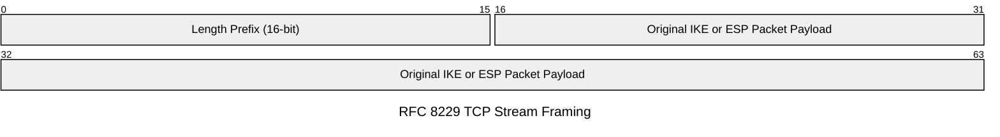

# SWAN-NG — UDP/TCP Encapsulation

All traffic encapsulated in Layer 4 (UDP/TCP) — raw IP Protocol 50 (ESP) not used at OS socket level.

---

## Standard Port Bindings

| Port | Protocol | Usage |
|---|---|---|
| UDP 500 | IKE | Initial IKEv1/IKEv2 negotiations |
| UDP 4500 | NAT-T / ESP | NAT-Traversal: encrypted ESP data + subsequent IKE packets |
| UDP 1701 | L2TP | L2TP/PPP session establishment |

---

## NAT-Traversal (UDP 4500)

NAT detected during UDP 500 handshake → all subsequent communication shifts to UDP 4500 → ESP packets prepended with 4-byte empty UDP header.

### Packet Demux (UDP:4500)

Non-ESP Marker (4 zero bytes) prepended to IKE packets on UDP 4500, distinguishing them from ESP packets (which start directly with the SPI field).

---

## TCP Fallback (RFC 8229)

For restrictive firewalls blocking all UDP — IKE and ESP packets framed over TCP stream with length prefix.

**Not implemented** — config fields `enable-tcp`, `tcp-remoteport` defined but no TCP listener code.

### TCP Workflow

### TCP Stream Framing

Every packet prefixed with 16-bit length integer for correct boundary slicing from the continuous TCP stream buffer.

